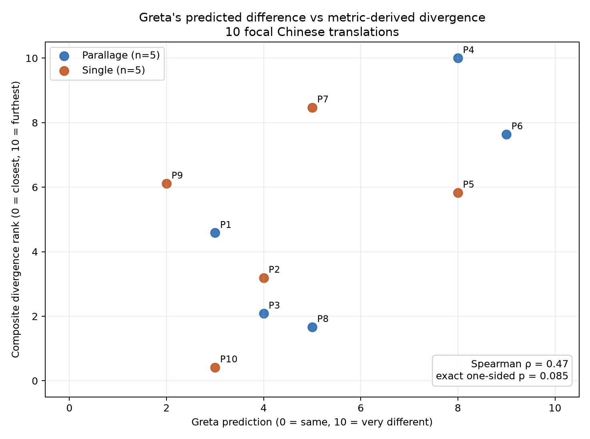

# Greta Chinese prediction analysis

## Result

Greta's ranking had a modest positive alignment with the reference-based metrics, but the ten-passage sample does not give strong statistical evidence beyond chance ranking.

Across the 10 focal translations, Greta's 0-10 predicted-difference rating had Spearman rho 0.472 against the composite reference-based divergence rank (exact one-sided permutation p=0.0848; bootstrap 95% interval -0.272 to 0.851). She ordered 27 of 41 comparable passage pairs correctly (65.9%).

This is evidence about similarity to Shirley Chan's supplied translation, not an independent proof of translation quality. A single human reference can penalize valid alternate renderings, so the result is best read as prediction-of-reference-difference.

## Passage results

| Passage | Treatment | Greta | Composite divergence | Rank error | BLEU-4 | chrF++ | METEOR | ROUGE-L | BERTScore | COMET | XCOMET | BLEURT |
|---:|:---|---:|---:|---:|---:|---:|---:|---:|---:|---:|---:|---:|
| 1 | parallage | 3 | 4.58 | 2.92 | 0.394 | 0.670 | 0.726 | 0.756 | 0.960 | 0.791 | 0.761 | 0.751 |
| 2 | single | 4 | 3.19 | 0.69 | 0.744 | 0.859 | 0.927 | 0.929 | 0.973 | 0.791 | 0.702 | 0.773 |
| 3 | parallage | 4 | 2.08 | 1.81 | 0.773 | 0.793 | 0.873 | 0.895 | 0.982 | 0.804 | 0.830 | 0.858 |
| 4 | parallage | 8 | 10.00 | 1.67 | 0.092 | 0.366 | 0.463 | 0.416 | 0.878 | 0.613 | 0.323 | 0.482 |
| 5 | single | 8 | 5.83 | 2.50 | 0.408 | 0.583 | 0.680 | 0.697 | 0.963 | 0.755 | 0.663 | 0.749 |
| 6 | parallage | 9 | 7.64 | 2.36 | 0.341 | 0.565 | 0.633 | 0.645 | 0.922 | 0.748 | 0.529 | 0.687 |
| 7 | single | 5 | 8.47 | 2.36 | 0.177 | 0.505 | 0.632 | 0.676 | 0.906 | 0.706 | 0.429 | 0.586 |
| 8 | parallage | 5 | 1.67 | 4.44 | 0.790 | 0.891 | 0.928 | 0.943 | 0.986 | 0.854 | 0.671 | 0.800 |
| 9 | single | 2 | 6.11 | 6.11 | 0.399 | 0.603 | 0.620 | 0.613 | 0.937 | 0.778 | 0.695 | 0.776 |
| 10 | single | 3 | 0.42 | 1.25 | 0.833 | 0.904 | 0.948 | 0.949 | 0.991 | 0.826 | 0.817 | 0.843 |

Higher metric values mean closer to Shirley's translation; higher composite divergence means further away.

## Metric-by-metric association

Negative correlations are expected because Greta rated predicted difference while each metric measures similarity.

| Metric | Mean | Range | Spearman rating vs similarity | exact p (two-sided) |
|:---|---:|:---|---:|---:|
| BLEU-4 | 0.495 | 0.092-0.833 | -0.417 | 0.2301 |
| chrF++ | 0.674 | 0.366-0.904 | -0.564 | 0.0936 |
| METEOR | 0.743 | 0.463-0.948 | -0.295 | 0.4067 |
| ROUGE-L | 0.752 | 0.416-0.949 | -0.337 | 0.3388 |
| word unigram F1 | 0.743 | 0.519-0.949 | -0.393 | 0.2606 |
| word trigram F1 | 0.457 | 0.057-0.865 | -0.540 | 0.1112 |
| character trigram F1 | 0.685 | 0.344-0.936 | -0.564 | 0.0936 |
| word edit similarity | 0.661 | 0.275-0.949 | -0.522 | 0.1252 |
| BERTScore F1 | 0.950 | 0.878-0.991 | -0.399 | 0.2526 |
| COMET | 0.767 | 0.613-0.854 | -0.540 | 0.1112 |
| XCOMET-XL | 0.642 | 0.323-0.830 | -0.730 | 0.0203 |
| BLEURT | 0.730 | 0.482-0.858 | -0.626 | 0.0584 |

## Parallage versus single condition

| Condition | n | Pearson r (p) | Spearman rho (exact p) | Kendall tau (p) | Pairwise concordance |
|:---|---:|---:|---:|---:|---:|
| parallage | 5 | 0.767 (0.130) | 0.500 (0.450) | 0.200 (0.817) | 6/10 (60.0%) |
| single | 5 | 0.336 (0.580) | 0.200 (0.783) | 0.200 (0.817) | 6/10 (60.0%) |

Pairwise concordance considers every pair of passages within a condition. A pair is correct when Greta's higher predicted-difference rating is assigned to the passage with the higher metric-derived divergence. With five distinct ratings per condition there are 10 comparable pairs; 6/10 concordant implies Kendall tau 0.20, while Spearman also accounts for how far apart the ranks are.

For XCOMET-XL alone, higher values mean greater similarity, so a correct predicted-difference signal has a negative correlation:

| Condition | n | Pearson r (p) | Spearman rho (exact p) | Kendall tau (p) |
|:---|---:|---:|---:|---:|
| parallage | 5 | -0.841 (0.074) | -0.800 (0.133) | -0.600 (0.233) |
| single | 5 | -0.342 (0.574) | -0.600 (0.350) | -0.400 (0.483) |

The 5-versus-5 condition split is descriptive only. It is too small to support a reliable treatment-effect claim, and Greta completed the conditions in blocks rather than interleaving them.

## Corpus-wide lexical check

All 280 completed Chinese model outputs (28 profiles x 10 passages) were scored against the new references. The five highest profile means across BLEU-4, chrF++, METEOR and ROUGE-L were:

| Rank | Profile | Focal | n | Lexical composite similarity |
|---:|:---|:---:|---:|---:|
| 1 | `classical_chinese_focal_scholarly` | yes | 10 | 0.666 |
| 2 | `parallage_04_minimal_inference` | no | 10 | 0.549 |
| 3 | `parallage_scholarly_edition` | no | 10 | 0.544 |
| 4 | `parallage_06_smooth_idiomatic` | no | 10 | 0.524 |
| 5 | `parallage_idiomatic_reader` | no | 10 | 0.513 |

## Data and validation

- Reference: Shirley Chan, `translationSC.docx`, SHA-256 `7828dd03d0370df90f7ea228c77756238bc6157409d1c60a3e06c754f7e4449b`.
- Join coverage: 10/10 reference passages, 10/10 focal runs and 10/10 latest Greta ratings; every rating variant ID matched the PostgreSQL focal run ID.
- Corpus coverage: 280/280 completed Chinese model outputs scored lexically, 10/10 focal outputs scored with the neural metric sidecar.
- METEOR implementation: NLTK METEOR with WordNet synonyms.
- Neural metric status: {"bertscore": "sidecar bert-score F1", "bleurt": "sidecar BLEURT checkpoint /home/stephanos/metric-envs/bleurt/BLEURT-20", "comet": "sidecar Unbabel/wmt22-comet-da", "xcomet": "sidecar Unbabel/XCOMET-XL"}.
- Composite divergence is the mean within-sample badness percentile across BLEU-4, chrF++, METEOR, ROUGE-L, BERTScore, COMET, XCOMET-XL and BLEURT. It is a transparent rank aggregate, not a calibrated quality score.
- Correlation confidence is limited by n=10, tied ratings, multiple metric comparisons and dependence among metrics.

## Reproducible artifacts

- `analysis/greta-chinese-focal-metrics-public.csv`: text-free metrics for the 10 rated focal translations.
- `analysis/greta-chinese-metric-associations.csv`: metric-level correlations.
- `analysis/chinese-all-translation-metrics-public.csv`: text-free lexical metrics for all 280 completed Chinese runs.
- `analysis/chinese-profile-metric-summary.csv`: 28 profile summaries.
- `analysis/greta-chinese-prediction-analysis.json`: calculations, checks and treatment summaries.
- `analysis/greta-chinese-neural-metrics.json`: stored neural-metric output.
- The local audit inputs retain the model outputs and expert references but are excluded from the public bundle pending co-author approval of release terms.
