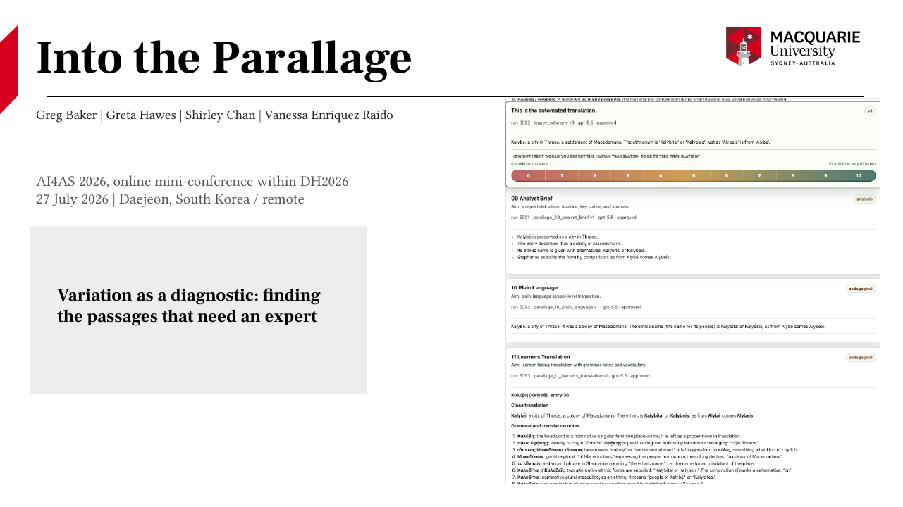
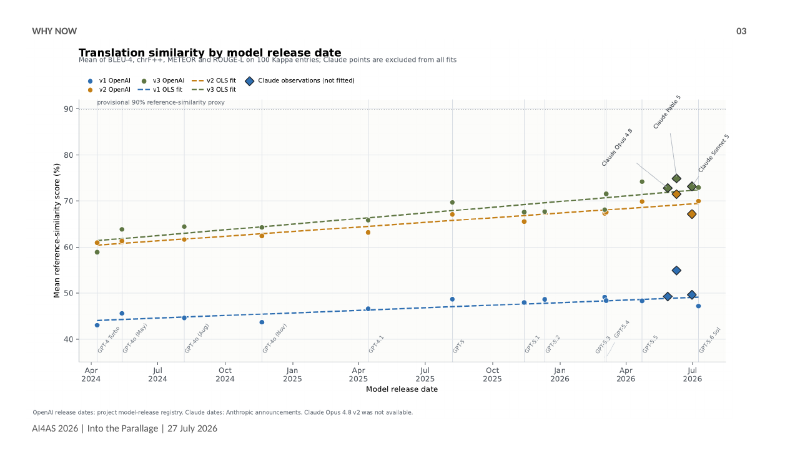
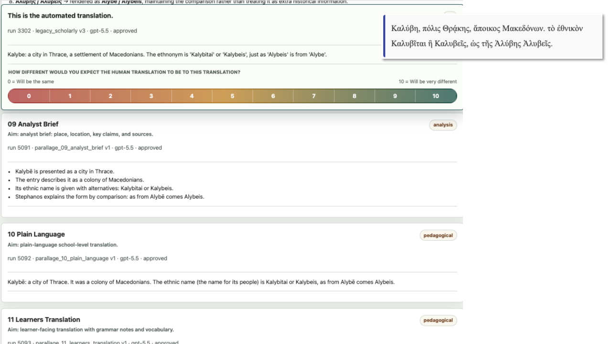
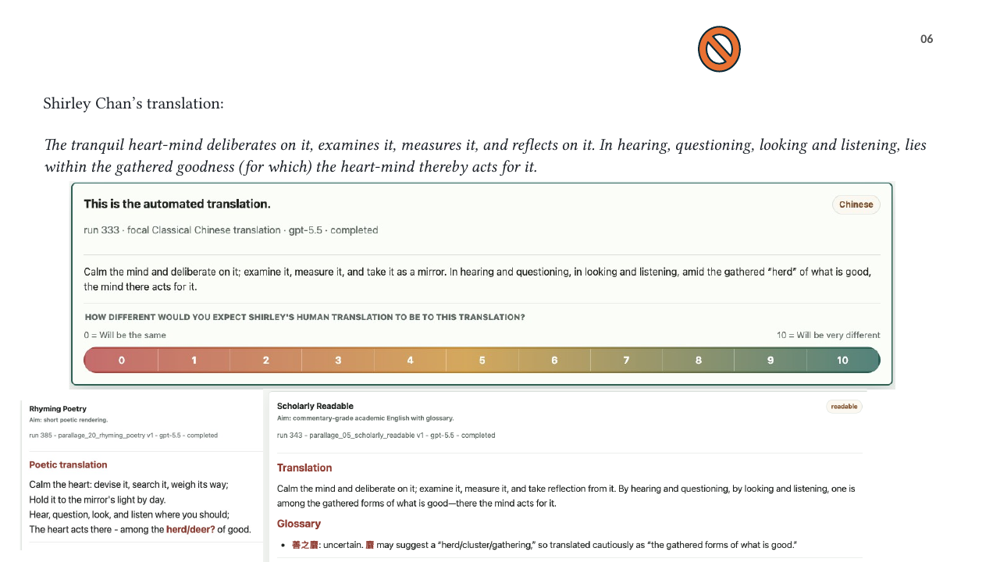
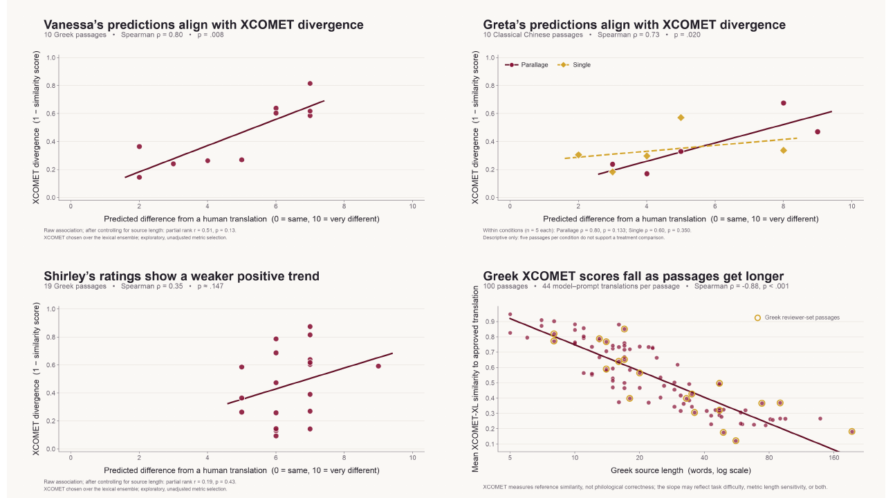
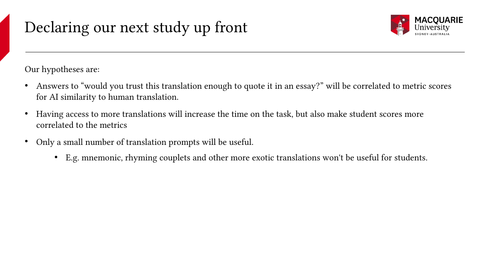
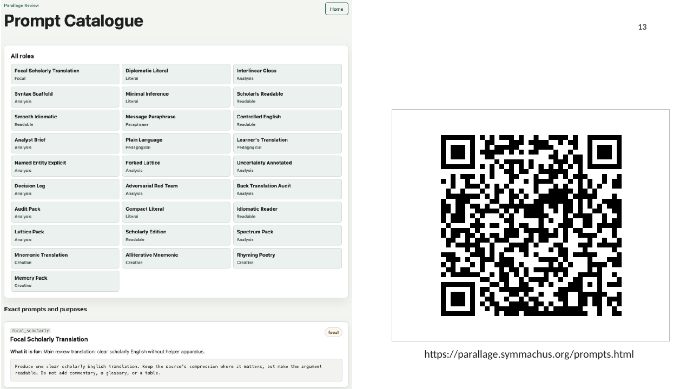

<!-- Generated from the hand-edited Word script by scripts/sync_ai4as_presentation_sources.py. -->

# Into the Parallage

## AI4AS 2026

Greg Baker, Shirley Chan, Vanessa Enriquez Raido, and Greta Hawes

27 July 2026

“Can AI produce a perfect translation?” isn’t the question we should be asking. The right question is: “how do we make use of the AI-powered abundance of cheap translations?” Can we use quantity to gain quality?

If we eschew the publication tax and simply put the translation up on a website, dissemination is cheap too. The expensive part is now verification. We think that the most important problem now is identifying which passages in an AI-powered translation need a more careful review.

We received research grant funding and decided to run an experiment where we asked whether having a lot of cheap AI-powered variant translations made it possible to identify passages that a primary focal AI translation handles poorly.

In Ancient Greek we have been working with Stephanos of Byzantium's Ethnika — the oldest surviving alphabetically organized encyclopedia, which is terse, repetitive, and full of place names and discussions about ethnicity.

For our Classical Chinese text, we used passages from a Warring States bamboo manuscript *Xin shi wei zhong* which were concerned with philosophical questions of the heart-mind, deliberation, and ethical judgement.  It shares the problem of a very compressed syntax and occasional challenges of textual reconstruction. But where Ethnika is very concrete – it is talking about particular people and places, Xin shi wei zhong is a philosophical and abstract.

The common challenge with translating these ancient texts – that have never been translated into English before – is that we can’t ask the author what they meant, and there are no native speakers that grew up in that culture that we can ask for advice.

We have been thinking that maybe we shouldn’t be trying to remove ambiguity and uncertainty. Perhaps instead we should try harder to make ambiguity and uncertainty obvious. This is the heart of the technique we have been working on which we call “parallage”. We have a lot of prompts – 27 at the moment – that deliberately force the language model to translate the passage in very different ways.

This chart tells us that verification is not going away anytime soon, but there are easy steps you can take to minimize it.

This is the reference-similarity results for the Greek Stephanos material. It’s on a scale of 0 to 100%, but the chart is truncated to hide all the empty parts. Human translators usually score about 90-95% reference similarity between each other, so you can see that AI is not at human standard yet regardless of what we do.

There are standard metrics of translation quality measurement that are widely used in the computing community: BLEU-4, chrF++, METEOR and ROUGE-L. What you see on this chart is the average of them.

We started with a naive prompt to do a single translation: “act as a classical translator and translate this”. It worked, but there were a lot of problems — that’s the bottom blue line. Then we translated some passages ourselves, gave the corrected translations to Anthropic Claude along with the originals, and asked it to create a new prompt. The very detailed prompt it produced — covering recurring constructions, named entities, and editorial conventions — improved the output substantially: that’s the gold-coloured line. A later, more modular version brought a further small improvement — the green-coloured line — and that last one is the prompt we used for all our Greek experiments.

Our Chinese experiments are still using the basic “act as a classical translator prompt” so their quality is equivalent to that low blue line.

We can make two observations from this chart. Firstly, we can make the prediction that we won’t see human-expert-level translation of ancient texts before 2030 unless AI capabilities break away from the current trend. Therefore, human verification will be essential for the remainder of the decade at least.

Secondly, you can reduce the human verification load with good prompting.

You are looking at parallage of the entry for the city of Kalybe in *Ethnica*.

This is the user interface we had in our pilot experiments for verification tooling. Each reviewer saw one focal translation, accompanied by helper variants generated from 27 deliberately different prompt roles. Every reviewer was assessing a language they did not know. For each passage they answered a single question on a scale from 0 to 10: how different would you expect the human translation to be from this one? Zero meant identical; ten meant very different.

Meanwhile, we also had expert translations done which we kept hidden from the reviewers. We used those expert human translations as the baseline, and calculated similarity metrics for the focal AI translation.

parallage partly displayed on screen shows why we think this approach is useful for flagging problems. The passage is:

寧心謀之、稽之、度之、鑒之，聞訊視聽，在善之麏，心焉為之。

Níng xīn móu zhī, jī zhī, duó zhī, jiàn zhī; wén xùn shì tīng, zài shàn zhī jūn; xīn yān wéi zhī.

There is a genuinely difficult phrase in it 在善之麏. The problem is 麏, which can denote a deer and may refer here to a herd, cluster, or a gathering.

Shirley Chan is our Chinese Classicist, and she translates it like this: *The tranquil heart-mind deliberates on it, examines it, measures it, and reflects on it. In hearing, questioning, looking and listening, lies within the gathered goodness (for which) the heart-mind thereby acts for it.*

Our scholarly AI translation — the focal translation for the experiment — kept the animal image, rendering the phrase as “amid the gathered ‘herd’ of what is good”.

Our scholarly-readable prompt produced something similar, but its glossary flagged the problem directly, marking 善之麏 as uncertain and noting that 麏 may suggest a herd, cluster, or gathering.

The rhyming-couplet translation gave the same clue by squeezing both alternatives into its final line: “The heart acts there—among the herd/deer? of good.”

A non-Chinese reader might suspect something is amiss with the herd reference in the focal translation, but with the additional translations the problem becomes impossible to miss.

This is where human oversight helps. Scholars generally agree that the manuscript’s 麏 should probably be 攈, which means “gather/glean”.

Likewise, the parallage helps with 寧心, níng xīn. Most of the translations make it an imperative verb — “calm the mind,” or “settle the heart-mind” — but a few offer alternatives such as “with a tranquil mind.”

It’s nice to have theoretical reasons for thinking that multiple translations make it easier to identify problems in translations, but does it work? That’s where the pilot experiment comes in.

Vanessa Enriquez Raido, a Translation Studies scholar, reviewed ten passages of Classical Greek — a language she doesn’t know.

Shirley Chan reviewed the Greek too, and Greta Hawes (our Greek specialist) reviewed the Chinese. I excluded myself because I was running the experimental analysis.

The charts on screen is showing XCOMET divergence – if the human translation was very different to the AI, it appears high on the y-axis; if the translation was the same it appears low.

The x-axis shows the answers to the question about what our raters expected.

First, there is a lot of depth of translation experience in the group, so it is possible that we are just reflecting on our knowledge of the quirks of translating into English. We will try to resolve this in a later experiment where we use monolingual students.

Second, look at Vanessa’s results. Across her ten passages, her judgements tracked the divergence scores with a Spearman rho of .796 and an exact two-sided p-value of .00845 — a result that would usually be read as a successful experiment. But there is a confounder sitting in the data.

In the Greek material, XCOMET similarity is much worse on longer passages. So a reader who understands neither the source nor the target language could score well simply by distrusting longer passages. When we control for source length, Vanessa’s scores end up with a p-value of about .130. So that doesn’t conclusively show parallage works: she could have scored close enough to what we saw just by looking at the length of the passage.

Greta’s predictions for her ten Chinese passages also tracked the XCOMET scores, with a p-value of .0203. Remember though, that the Chinese passages only use a naïve prompt, so there are a lot more problems in their translations. Greta’s task had an extra twist: half of the passages she saw had the parallage hidden, so she was judging a single text on its own. On the five parallage passages, rho was .800; on the five single-output passages, rho was .600. They are different, but not enough for us to declare statistical significance.

Shirley looked at 19 translations and found an inconclusive positive trend: rho of .35, with a p-value of .143 — not statistically significant, but still a promising initial result.

The scientific replication crisis has taught us the value of preregistering studies and stating hypotheses in advance. (We didn’t do that for those initial experiments). We will run a preregistered comparison with student readers who do not know the source language, between two conditions: the same focal translation shown by itself, and the same focal translation shown with the full Parallage helper pack.

We plan to ask the question slightly differently: “would you trust this translation enough to quote it in an essay?” It’s easier for students to relate to, and it captures something we care about: whether we can instill well-founded skepticism in students when it is warranted.

Our hypotheses are:

- Having access to an abundance of translations will be useful. The answers to the question will be correlated to the metric scores for AI similarity.

- Having more translations will increase the time on the task. That is, we expect that students will read the alternate translations.

- Only a small number of translation prompts will be useful. Mnemonic, rhyming couplets and other more exotic translations won't be useful for students.

We have put our prompt library up on the web at the URL and QR code on screen, so that you can set up your own Parallage. We can also share the code for the experimental platform if you want a copy of it. To summarise: don’t wait for the perfect AI translation. Instead, a good approach is to let the abundance of variants that AI can make do the job of making ambiguities visible. That way you can lessen the verification load by focusing on the problematic passages.
